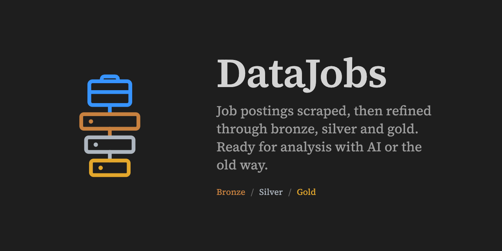
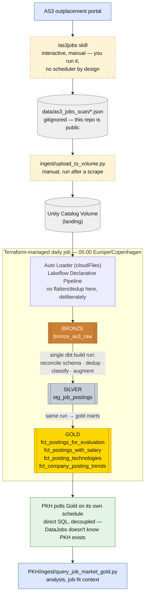

# DataJobs

Bronze/Silver/Gold data pipeline over AS3 outplacement portal job postings,
built to practice Databricks Lakeflow + dbt + Terraform, and to actually
drive real job-search decisions by exposing a Gold layer to
[PKH](https://github.com/Georgi-Petkov/personalknowhow) (a personal knowledge graph / job-fit agent) for analysis.

**Status: live.** Bronze, Silver, and Gold are all real, deployed, and
scheduled daily via Terraform-managed jobs. A Genie space exists for
natural-language querying. See [`PIPELINE_ARCHITECTURE.md`](PIPELINE_ARCHITECTURE.md)
for the full build history — what's real, what bugs were hit and fixed,
what's still open.

*Genie (Databricks mobile) answering "Show me the latest 4 jobs" against the Gold layer — natural-language question → SQL → results. ([full-resolution video](design/demo/genie-datajobs-demo.mp4))*

Genie space (`space_id: 01f1a4863d4c1d88982f6819eb80c370`) sits over
Bronze/Silver/Gold together for ad hoc natural-language questions —
available on desktop and the Databricks mobile app.

## Layout

- `.claude/skills/as3jobs/` — the AS3 scraper, interactive/manual by
  design. Moved here from PKH so scraping is entirely DataJobs' concern,
  start to finish — PKH holds no scraping logic or raw job data at all.
- `data/` — gitignored (this repo is public), where `/as3jobs` saves dated
  snapshot JSON files.
- `databricks/datajobs_pipeline/` — the Lakeflow Declarative Pipeline
  source (Bronze, Auto Loader only, no flatten/dedup), the dbt-runner
  notebook, and one-off setup scripts (e.g. the Genie space builder).
- `ingest/` — the source contract raw JSON must follow, and the script
  that lands scraped local JSON into the Unity Catalog Volume.
- `dbt/datajobs/` — Silver (clean/dedup/classify/augment) and the four
  Gold marts.
- `terraform/` — manages the schema/volume, the Lakeflow pipeline, the
  dbt-runner notebook, and the chained daily job, as code.

## Why this exists

Two things drove this project — see `PIPELINE_ARCHITECTURE.md` for the
full reasoning and real build history:

1. **Cert-prep hands-on reps** — real, hands-on practice with Databricks
   Lakeflow and Terraform: designing, deploying, and operating a
   production-grade pipeline end-to-end rather than following a tutorial.
2. **Real job-search value** — turning ad hoc, print-to-stdout job-market
   analysis into persisted, queryable Gold tables that can actually inform
   decisions, with PKH consuming the results for job-fit evaluation.
